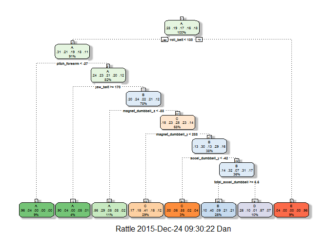
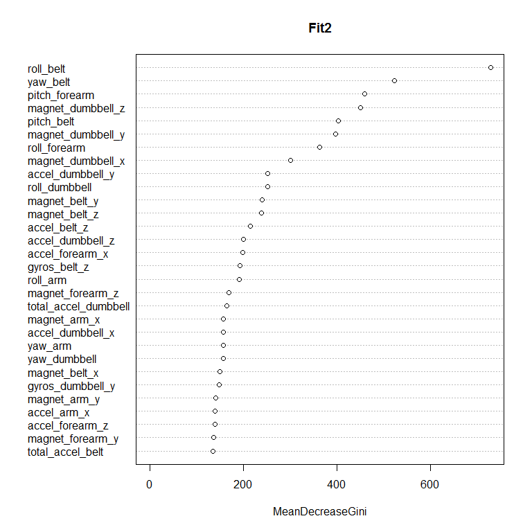

# Analysis of Weight Lifting Exercise dataset
Foo HP  
Thursday, December 24, 2015  
## Synopsis
 
The objective of this project is to use data from <http://groupware.les.inf.puc-rio.br/har> (see the section on the Weight Lifting Exercise Dataset) to investigate "how (well)" an activity was performed by the wearer.

6 participants were asked to perform one set of 10 repetitions of the Unilateral Dumbbell Biceps Curl in five different fashions: exactly according to the specification (Class A), throwing the elbows to the front (Class B), lifting the dumbbell only halfway (Class C), lowering the dumbbell only halfway (Class D) and throwing the hips to the front (Class E).


The goal is to predict the manner in which they did the exercise( "classe" variable )  using any of the other variables to predict with. i.e. predict activity quality from activity monitors/sensors


## Data
 
The data for this project come from the source:

<http://groupware.les.inf.puc-rio.br/har>


The training data for this project : 

<https://d396qusza40orc.cloudfront.net/predmachlearn/pml-training.csv>

The test data for this project : 

<https://d396qusza40orc.cloudfront.net/predmachlearn/pml-testing.csv>


## Load Data and required packages

```r
library(caret)
library(rpart)
library(randomForest)

trainU <- "http://d396qusza40orc.cloudfront.net/predmachlearn/pml-training.csv"  
testU<- "http://d396qusza40orc.cloudfront.net/predmachlearn/pml-testing.csv"
Org_Training <- read.csv(url(trainU),na.strings=c("NA",""))
Org_Test <- read.csv(url(testU),na.strings=c("NA",""))
```

## Process and Clean the Data
The original training and test datasets  provided for this project, contain (19622 observations of 160 variables) and  (20 observations of 160 variables) respectively.
Both datasets contain the same variables except for the last variable, the orignal training dataset contain the outcome variable "classe" whereas the original test dataset contain the variable "problem_id".

Out of the 160 variables, 152 variables are measurements related to the 4 sensors (arm,forearm,belt & dumbbell).  On exploration of the Original Training data, I discovered that there are many missing values or NAs. 60 variables contain zero NAs and the remaining 100 variables contain 97.93 % NAs. As the 100 variables contain a significant percentage (97.93%) of NAs and may not be good predictors,these variables will be removed. 

The first 7 column variables of the Original Training dataset, 

X,user_name,raw_timestamp_part_1,raw_timestamp_part_2,cvtd_timestamp,new_window,num_window

relate to the identity of the participant, the timestamp and sliding window .

These are **NON-sensor** related variables and as such are not relevant predictors for the outcome, and will be removed.  

The trimmed training dataset (Trim_Training) now contains 52 predictor variables and 1 outcome variable.

Next, check for near zero variance predictors from the remaining 52 predictor variables  and conclude that there are **NO** zero variance predictors within them.

Similarly, the trimmed Test dataset(Trim_Test) also contain 52 predictor variables.


## Cross Validation & Out of sample error

Split the Trim_Training dataset into training (60%) and testing (40%) datasets using 
createDataPartition. Build a model on the training subset and evaluate on the testing subset (held out).

Out of sample error is the error resulted from applying the prediction algorithm to a new data set. I expect the out of sample error to be small.  To accurately estimate the out of sample error ,it is important to hold out an untouched sample (e.g. testing subset). Using ConfusionMatrix, the estimated out of sample error is computed as (1- accuracy). 

## Build Model - Classification Tree
Fit classification tree as a model on the training subset. Plot the classification Tree. Predict on the testing subset and tabulate the predictions of the model against the actual outcome using ConfusionMatrix. The accuracy of this model (Fit1) is 0.5654 The estimated out of sample error is (1- accuracy) =  **0.4346**

## Build Model - Random Forest
Fit model on the training subset using randomForest algorithm .Plot Dotchart of variable importance as measured by Random Forest.Predict on the testing subset and tabulate the predictions of the model against the actual outcome using ConfusionMatrix. The accuracy of this model (Fit2) is 0.9918  The estimated out of sample error is (1- accuracy) = **0.0082** 

## Conclusion 
The model Fit 2 ,built using randomForest algorithm is a better model (0.9918) compared to Classification Tree (0.5654) in terms of higher accuracy and lower out of sample error 
(0.0082) compared to (0.4346). As such this model will be  used to predict the 20 different test cases . 
The prediction result is :

  B  A  B  A  A  E  D  B  A  A  B  C  B  A  E  E  A  B  B  B  

## Reference

Velloso, E.; Bulling, A.; Gellersen, H.; Ugulino, W.; Fuks, H. Qualitative Activity Recognition of Weight Lifting Exercises. Proceedings of 4th International Conference in Cooperation with SIGCHI (Augmented Human '13) . Stuttgart, Germany: ACM SIGCHI, 2013.


\newpage

# Appendix   


```r
dim(Org_Training)
```

```
## [1] 19622   160
```

```r
dim(Org_Test)
```

```
## [1]  20 160
```


```r
Nomatch <- !(names(Org_Training) %in% names(Org_Test))
nameTr <- names(Org_Training)     # Variable names of Original Training dataset
sensordata_var <- nameTr[grepl("_arm|_forearm|_belt|_dumbbell",nameTr)]
length(sensordata_var)            #number of sensor related variables
```

```
## [1] 152
```

```r
nameTr[Nomatch]                   # Non-match variable in Original Training dataset
```

```
## [1] "classe"
```

```r
nameTs <- names(Org_Test)         # Variable names of Original Test dataset
nameTs[Nomatch]                   # Non-match variable in Original Test dataset
```

```
## [1] "problem_id"
```

```r
a <-sapply(Org_Training,is.na)     ## Check for NAs
b <-colSums(a)               ## Identify number of NAs in column 
c <- round(b*100/nrow(Org_Training),2)  ## Percentage of NAs in column
table(c)                     ## Tabulate percentage of NAs 
```

```
## c
##     0 97.93 
##    60   100
```

```r
Trim_Training <- Org_Training[which(b==0)] ## Extract zero NA columns 
## Further trim out the non-relevant variables
Trim_Training <- Trim_Training[,-c(1:7)]
 ##Extract similar variables for Test data set except "classe" column (col 53)
Trim_Test <- Org_Test[colnames(Trim_Training[,-53])] 
# Check for near zero variance on the 52 variables excluding "classe" variable 
NZV <- nearZeroVar(Trim_Training[,-53],saveMetrics=TRUE)
# Identify whether any near zero variance predictors exist in Trim_Training
near_zero_item <- sum(NZV$nzv)
near_zero_item
```

```
## [1] 0
```

# Cross Validation

```r
set.seed(3388)
inTrain<-createDataPartition(y=Trim_Training$classe, p=0.6, list=FALSE)
training <-Trim_Training[inTrain, ]
testing <-Trim_Training[-inTrain, ]
dim(training)
```

```
## [1] 11776    53
```

```r
dim(testing)
```

```
## [1] 7846   53
```
Build Model - Classification Tree

```r
Fit1 <- train(classe~ .,data=training,method="rpart")
print(Fit1)
```

```
## CART 
## 
## 11776 samples
##    52 predictor
##     5 classes: 'A', 'B', 'C', 'D', 'E' 
## 
## No pre-processing
## Resampling: Bootstrapped (25 reps) 
## Summary of sample sizes: 11776, 11776, 11776, 11776, 11776, 11776, ... 
## Resampling results across tuning parameters:
## 
##   cp          Accuracy   Kappa       Accuracy SD  Kappa SD  
##   0.02990033  0.5548401  0.42538392  0.02980299   0.04644506
##   0.04648196  0.4879813  0.33084705  0.03610585   0.06443066
##   0.11568581  0.3170101  0.04931123  0.04120861   0.06167437
## 
## Accuracy was used to select the optimal model using  the largest value.
## The final value used for the model was cp = 0.02990033.
```

```r
print(Fit1$finalModel)
```

```
## n= 11776 
## 
## node), split, n, loss, yval, (yprob)
##       * denotes terminal node
## 
##   1) root 11776 8428 A (0.28 0.19 0.17 0.16 0.18)  
##     2) roll_belt< 129.5 10723 7414 A (0.31 0.21 0.19 0.18 0.11)  
##       4) pitch_forearm< -26.65 1038   42 A (0.96 0.04 0 0 0) *
##       5) pitch_forearm>=-26.65 9685 7372 A (0.24 0.23 0.21 0.2 0.12)  
##        10) yaw_belt>=169.5 475   46 A (0.9 0.038 0 0.048 0.011) *
##        11) yaw_belt< 169.5 9210 6991 B (0.2 0.24 0.22 0.21 0.12)  
##          22) magnet_dumbbell_z< -87.5 1256  553 A (0.56 0.29 0.05 0.082 0.021) *
##          23) magnet_dumbbell_z>=-87.5 7954 5963 C (0.15 0.23 0.25 0.23 0.14)  
##            46) magnet_dumbbell_y< 288.5 3423 2020 C (0.17 0.15 0.41 0.15 0.12) *
##            47) magnet_dumbbell_y>=288.5 4531 3186 B (0.13 0.3 0.13 0.29 0.16)  
##              94) accel_dumbbell_y< -42.5 343   41 C (0 0.058 0.88 0.023 0.038) *
##              95) accel_dumbbell_y>=-42.5 4188 2863 B (0.14 0.32 0.068 0.31 0.17)  
##               190) total_accel_dumbbell>=5.5 3016 1805 B (0.096 0.4 0.092 0.21 0.21) *
##               191) total_accel_dumbbell< 5.5 1172  503 D (0.26 0.097 0.0077 0.57 0.066) *
##     3) roll_belt>=129.5 1053   39 E (0.037 0 0 0 0.96) *
```

```r
rattle::fancyRpartPlot(Fit1$finalModel)    # plot the classification tree
```

 

```r
P1 <- predict(Fit1,newdata=testing)        # predict on testing subset
confusionMatrix(P1,testing$classe)         # Create a confusion matrix 
```

```
## Confusion Matrix and Statistics
## 
##           Reference
## Prediction    A    B    C    D    E
##          A 1423  283   36   71   18
##          B  194  802  183  426  423
##          C  398  364 1145  408  272
##          D  182   69    4  381   44
##          E   35    0    0    0  685
## 
## Overall Statistics
##                                           
##                Accuracy : 0.5654          
##                  95% CI : (0.5543, 0.5764)
##     No Information Rate : 0.2845          
##     P-Value [Acc > NIR] : < 2.2e-16       
##                                           
##                   Kappa : 0.4533          
##  Mcnemar's Test P-Value : < 2.2e-16       
## 
## Statistics by Class:
## 
##                      Class: A Class: B Class: C Class: D Class: E
## Sensitivity            0.6375   0.5283   0.8370  0.29627  0.47503
## Specificity            0.9273   0.8063   0.7774  0.95442  0.99453
## Pos Pred Value         0.7772   0.3955   0.4426  0.56029  0.95139
## Neg Pred Value         0.8655   0.8769   0.9576  0.87371  0.89377
## Prevalence             0.2845   0.1935   0.1744  0.16391  0.18379
## Detection Rate         0.1814   0.1022   0.1459  0.04856  0.08731
## Detection Prevalence   0.2334   0.2585   0.3297  0.08667  0.09177
## Balanced Accuracy      0.7824   0.6673   0.8072  0.62534  0.73478
```
#Build Model - Random Forest

```r
Fit2 <- randomForest(classe ~ .,data=training)
print(Fit2)
```

```
## 
## Call:
##  randomForest(formula = classe ~ ., data = training) 
##                Type of random forest: classification
##                      Number of trees: 500
## No. of variables tried at each split: 7
## 
##         OOB estimate of  error rate: 0.67%
## Confusion matrix:
##      A    B    C    D    E  class.error
## A 3345    3    0    0    0 0.0008960573
## B   13 2261    5    0    0 0.0078982010
## C    0   17 2034    3    0 0.0097370983
## D    1    0   29 1898    2 0.0165803109
## E    0    0    2    4 2159 0.0027713626
```

```r
varImpPlot(Fit2,type=2)
```

 

```r
P2 <- predict(Fit2,newdata=testing)
confusionMatrix(P2,testing$classe)
```

```
## Confusion Matrix and Statistics
## 
##           Reference
## Prediction    A    B    C    D    E
##          A 2229   13    0    0    0
##          B    3 1502    8    0    0
##          C    0    3 1358   30    1
##          D    0    0    2 1256    4
##          E    0    0    0    0 1437
## 
## Overall Statistics
##                                           
##                Accuracy : 0.9918          
##                  95% CI : (0.9896, 0.9937)
##     No Information Rate : 0.2845          
##     P-Value [Acc > NIR] : < 2.2e-16       
##                                           
##                   Kappa : 0.9897          
##  Mcnemar's Test P-Value : NA              
## 
## Statistics by Class:
## 
##                      Class: A Class: B Class: C Class: D Class: E
## Sensitivity            0.9987   0.9895   0.9927   0.9767   0.9965
## Specificity            0.9977   0.9983   0.9948   0.9991   1.0000
## Pos Pred Value         0.9942   0.9927   0.9756   0.9952   1.0000
## Neg Pred Value         0.9995   0.9975   0.9985   0.9954   0.9992
## Prevalence             0.2845   0.1935   0.1744   0.1639   0.1838
## Detection Rate         0.2841   0.1914   0.1731   0.1601   0.1832
## Detection Prevalence   0.2858   0.1928   0.1774   0.1608   0.1832
## Balanced Accuracy      0.9982   0.9939   0.9937   0.9879   0.9983
```
# Use Model built using randomForest algorithm, to predict the 20 different test cases

```r
ANS <- predict(Fit2,newdata=Trim_Test)
ANS
```

```
##  1  2  3  4  5  6  7  8  9 10 11 12 13 14 15 16 17 18 19 20 
##  B  A  B  A  A  E  D  B  A  A  B  C  B  A  E  E  A  B  B  B 
## Levels: A B C D E
```

#For each test case, create a text file with a single capital letter (A, B, C, D, or E) corresponding to the above prediction for the corresponding problem in the test data set. 

```r
pml_write_files = function(x){
  n = length(x)
  for(i in 1:n){
    filename = paste0("problem_id_",i,".txt")
    write.table(x[i],file=filename,quote=FALSE,row.names=FALSE,col.names=FALSE)
  }
}

pml_write_files(ANS)
```
